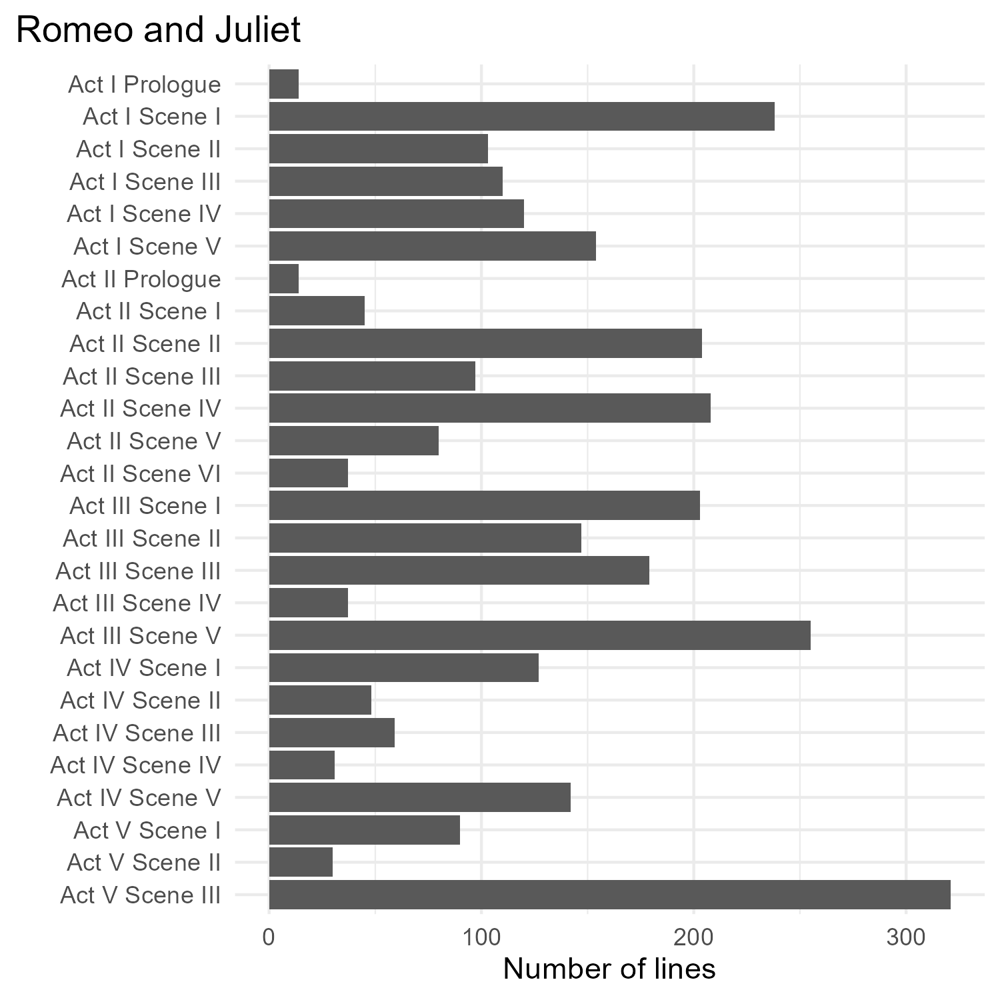
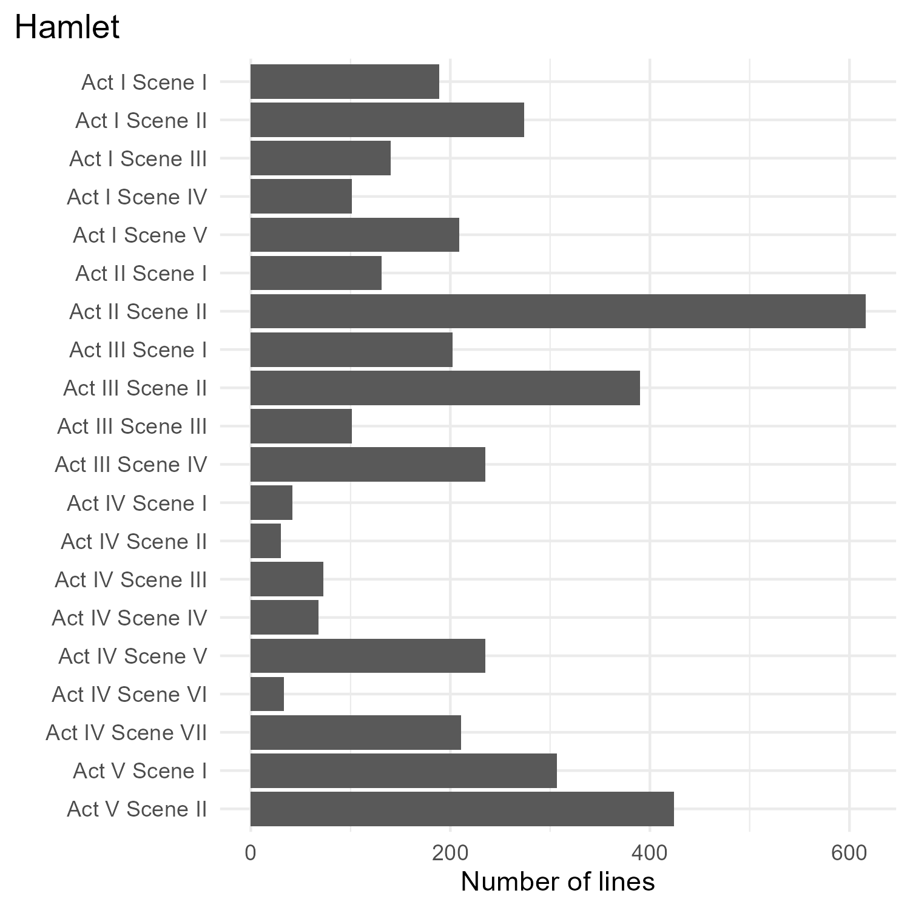

# Shakespeare

This repository contains data on the plays of William Shakespeare.

## Data

The data is scraped from [shakespeare.mit.edu](https://shakespeare.mit.edu/), and processed into CSV format. The processing code can be found in the `R/functions.R` file. The website [shakespeare.mit.edu](https://shakespeare.mit.edu/) states that the HTML versions of the plays provided there are placed in the public domain, and the versions here follow suit.

### Works included

This repository is a work-in-progress. Works currently included in CSV format:

* Hamlet
* The Life and Death of Julius Caesar
* Macbeth
* Othello
* Romeo and Juliet

## Analysis

See [github.com/nrennie/bechdel-test](https://github.com/nrennie/bechdel-test) for an example of analysis performed on the Romeo and Juliet dataset.

### Plots

  
  

### TidyTuesday

Some of these datasets were used for TidyTuesday data in September 2024: [github.com/rfordatascience/tidytuesday/blob/master/data/2024/2024-09-17/readme.md](https://github.com/rfordatascience/tidytuesday/blob/master/data/2024/2024-09-17/readme.md)
